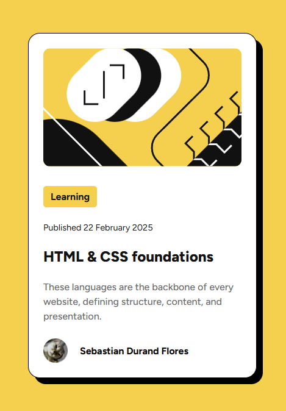

# Frontend Mentor - Blog preview card (Solución)

Esta es una solución al desafío de la tarjeta de vista previa del blog en Frontend Mentor(https://www.frontendmentor.io/challenges/blog-preview-card-ckPaj01IcS). Los desafíos de Frontend Mentor te ayudan a mejorar tus habilidades de codificación mediante la creación de proyectos realistas.

## Tabla de contenido

- [Descripción general](#descripción-general)
  - [El desafío](#el-desafío)
  - [Captura de pantalla](#captura-de-pantalla)
  - [Enlaces](#enlaces)
- [Mi proceso](#mi-proceso)
  - [Construido con](#construido-con)
- [Autor](#autor)

## Descripción general

### El desafío

Los usuarios deberían poder:

- Ver los estados de desplazamiento y enfoque de todos los elementos interactivos de la página

### Captura de pantalla

### Enlaces

- Url a la solución: [GitHub-repository](https://github.com/dandfres/preview-card-main)
- Sitio desplegado: [Github-pages](https://dandfres.github.io/preview-card-main/)

## Mi proceso
1. Hize un boceto (wireframe) para definir la estructura y dispocicion de los elementos.
2. Se estableció la estructura del html para luego darle estilo con css.
3. Luego subí el proyecto a mi repositorio.
4. Por ultimo edite el `README.md`.

### Construido con

- Semantic HTML5 markup
- CSS custom properties
- Flexbox

## Autor

- Frontend Mentor - [@dandfres](https://www.frontendmentor.io/profile/dandfres)
- Github - [@dandfres](https://github.com/dandfres)